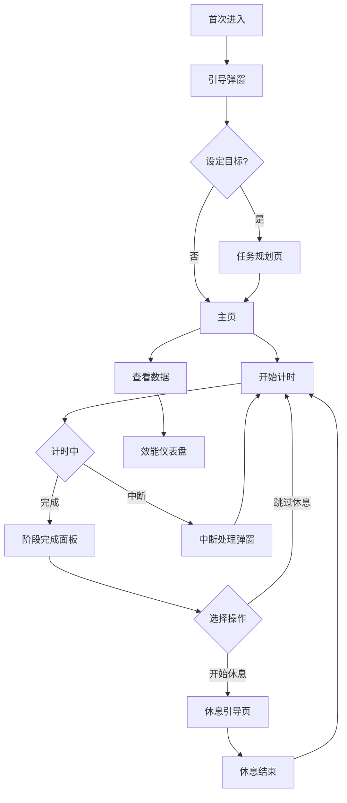

## 1. Product Overview
番茄钟专注陪伴 App（萌系视觉版）是一款基于 Pomodoro 技术的专注计时应用，通过可爱的动物角色（仓鼠、小鹿、兔子、蝴蝶、小狗）和萌系视觉设计，为用户提供愉悦的专注体验。目标用户为需要提升专注力的学生、职场人士和自由职业者。

## 2. Core Features

### 2.1 User Roles
| Role | Registration Method | Core Permissions |
|------|---------------------|------------------|
| Normal User |无需注册 |使用全部功能：计时、任务管理、AI陪伴、数据统计 |

### 2.2 Feature Module
1. **主页**: 计时圆环、任务卡片、控制按钮、音乐播放条、AI悬浮按钮
2. **阶段完成面板**: 庆祝动画、状态切换按钮、中断摘要
3. **中断处理弹窗**: 中断类型选择、干扰代价提示
4. **首次引导弹窗**: 目标设定引导
5. **任务规划页**: 任务管理、番茄数调节、倾泻区、如果-那么计划
6. **休息引导页**: 倒计时、休息类型选择、AI轻互动、拉伸引导
7. **AI对话页**: 情绪选择、聊天界面、快捷指令
8. **效能仪表盘**: 番茄链热力图、精力周期图谱、中断归因饼图、散点图
9. **设置页**: 个性化设置、模型信息、隐私说明

### 2.3 Page Details
| Page Name | Module Name | Feature description |
|-----------|-------------|---------------------|
| Home | Timer Circle | 仓鼠跑轮动画，根据剩余时间调整速度 |
| Home | Task Card | 显示当前任务，无任务时显示引导提示 |
| Home | Control Buttons | 开始/暂停、中断、重置功能 |
| Home | Music Bar | 背景音效控制 |
| Home | AI Float Button | 快速进入AI对话 |
| Phase Complete | Celebration | 小狗蹦跳动画，蝴蝶粒子飘落 |
| Interrupt | Type Selection | 内部/外部中断分类记录 |
| Onboarding | Goal Setting | 引导用户设定今日目标 |
| Task Plan | Task Management | 添加、编辑、删除任务 |
| Task Plan | Brain Dump | 想法倾泻区域 |
| Break Guide | Rest Options | 放空、微社交、身体活动 |
| AI Chat | Emotion Selection | 5种情绪标签选择 |
| Dashboard | Statistics | 各项数据可视化展示 |
| Settings | Preferences | 个性化设置项 |

## 3. Core Process
用户首次进入 → 引导设定目标 → 开始专注计时 → 完成/中断 → 休息引导 → 继续/结束 → 查看统计数据

## 4. User Interface Design

### 4.1 Design Style
- **主色**: 紫藤 #C9A7EB、浅紫 #E8D5F5
- **点缀色**: 浆果红 #FF6B6B、暖粉 #FFB3BA
- **辅助色**: 奶油黄 #FFF3E0、薄荷绿 #B5EAD7
- **中性色**: 暖灰 #5A4E6B、深紫灰 #3D334A
- **背景色**: 奶油白 #FFFBF7
- **字体**: 圆体/卡通风格无衬线，标题20-22sp粗体，正文14-16sp常规，数字48-56sp粗体
- **圆角**: 卡片24px、按钮20px/16px、弹窗28px
- **阴影**: 0 4px 15px rgba(201, 167, 235, 0.2)

### 4.2 Page Design Overview
| Page Name | Module Name | UI Elements |
|-----------|-------------|-------------|
| Home | Timer | 浅紫圆环背景，浆果红/薄荷绿进度，仓鼠跑轮动画，半透明数字叠加 |
| Home | Task Card | 奶油黄背景，小兔子插图，胶囊形标签 |
| Home | AI Button | 小鹿头像，浆果红未读红点 |
| Phase Complete | Celebration | 浅紫到奶油白渐变，蝴蝶粒子，小狗蹦跳动画 |
| AI Chat | Chat Area | 浅紫AI气泡，浆果红用户气泡，情绪选择栏 |
| Dashboard | Charts | 紫色系热力图，藤蔓折线图，动物头像散点图 |

### 4.3 Responsiveness
- iPhone 15 Pro 尺寸模拟 (393 x 852)
- 移动端优先设计
- 触摸友好的交互元素

### 4.4 Animation Guidelines
- 仓鼠跑轮：速度随剩余时间变化
- 蝴蝶飘飞：休息页和阶段完成页随机飘过
- 小鹿眨眼：AI对话时头像间歇眨眼
- 小狗蹦跳：庆祝弹窗出现时
- 按钮反馈：弹性压缩回弹动画
