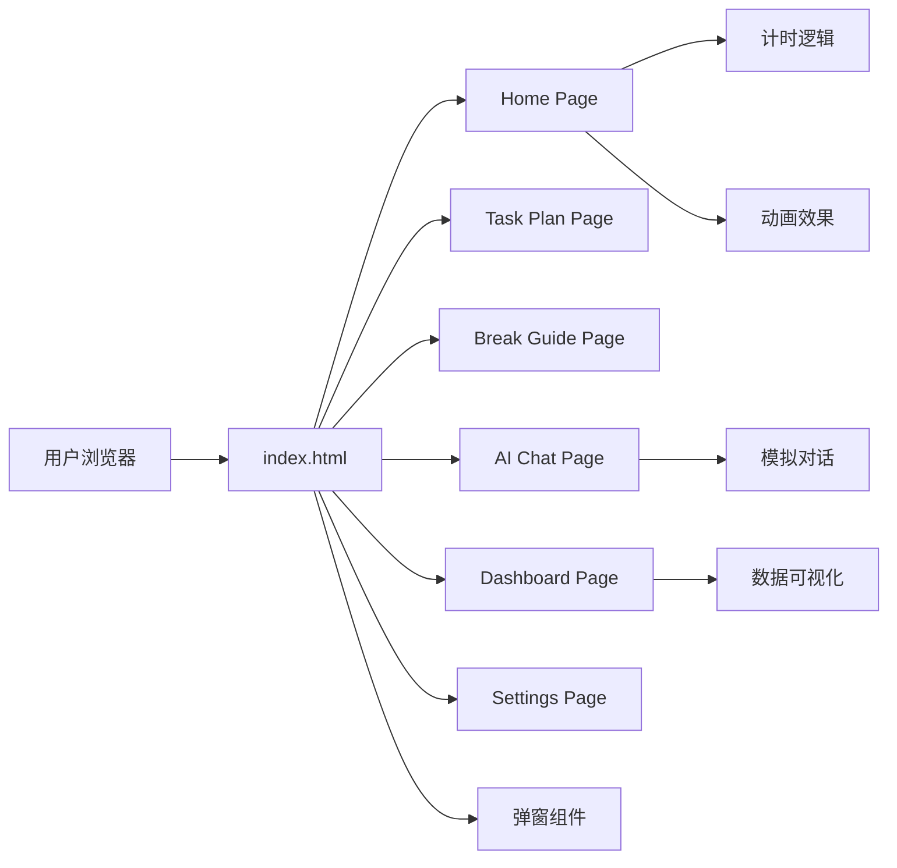

## 1. Architecture Design


## 2. Technology Description
- **Frontend**: HTML5 + Tailwind CSS 3 + JavaScript (纯前端实现，无需框架)
- **Icons**: FontAwesome + 自定义SVG动物图标
- **Animation**: CSS Keyframes + JavaScript 控制
- **页面容器**: iframe 嵌入，index.html 作为主入口

## 3. Route Definitions
| Route | Purpose | File |
|-------|---------|------|
| /home | 主页（计时器） | home.html |
| /task-plan | 任务规划页 | task-plan.html |
| /break-guide | 休息引导页 | break-guide.html |
| /ai-chat | AI对话页 | ai-chat.html |
| /dashboard | 效能仪表盘 | dashboard.html |
| /settings | 设置页 | settings.html |

## 4. Directory Structure
```
.
├── index.html              # 主入口，iframe嵌入各页面
├── assets/
│   ├── css/
│   │   └── styles.css      # 全局样式和颜色变量
│   ├── js/
│   │   └── common.js       # 通用函数和动画控制
│   └── icons/
│       └── animals.svg     # 动物角色SVG图标
├── home.html               # 主页
├── task-plan.html          # 任务规划页
├── break-guide.html        # 休息引导页
├── ai-chat.html            # AI对话页
├── dashboard.html          # 效能仪表盘
├── settings.html           # 设置页
└── components/
    ├── phase-complete.html # 阶段完成弹窗
    ├── interrupt.html      # 中断处理弹窗
    └── onboarding.html     # 首次引导弹窗
```

## 5. Color Variables (CSS)
```css
--color-wisteria: #C9A7EB;
--color-light-purple: #E8D5F5;
--color-berry-red: #FF6B6B;
--color-warm-pink: #FFB3BA;
--color-cream-yellow: #FFF3E0;
--color-mint-green: #B5EAD7;
--color-warm-gray: #5A4E6B;
--color-deep-purple-gray: #3D334A;
--color-cream-white: #FFFBF7;
```

## 6. Font Variables (CSS)
```css
--font-family-display: 'ZCOOL KuaiLe', 'PingFang SC', sans-serif;
--font-size-title: 20-22px;
--font-size-body: 14-16px;
--font-size-timer: 48-56px;
```

## 7. Animation Keyframes
- `hamster-run`: 仓鼠跑轮动画
- `butterfly-fly`: 蝴蝶飘飞动画
- `deer-blink`: 小鹿眨眼动画
- `dog-jump`: 小狗蹦跳动画
- `button-bounce`: 按钮弹性反馈

## 8. Mock Data
- 任务列表示例数据
- 番茄钟历史记录（热力图）
- AI对话示例消息
- 效能统计数据（精力周期、中断归因等）
